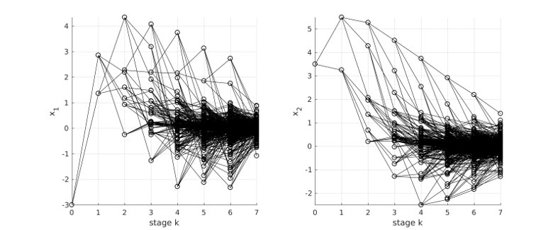

# Marietta

Marietta is a MATLAB toolbox for risk-averse risk-constrained multistage optimal control.

About the toolbox:

* **Download**: Download the [latest version](https://github.com/kul-forbes/risk-averse/archive/master.zip)
* **Installation**: run `matlab/setupMarietta`
* **License**: [MIT License]()
* **Developed by**: P. Sopasakis, M. Schuurmans and P. Patrinos

Check out the [** detailed documentation**](./matlab/README.md).