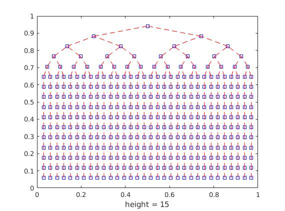
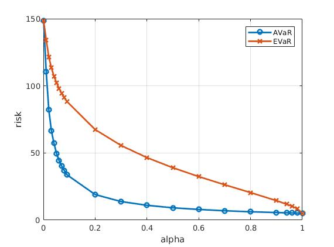
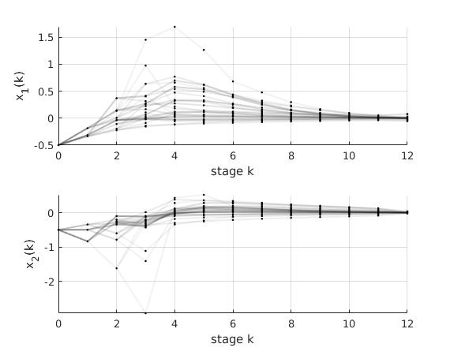
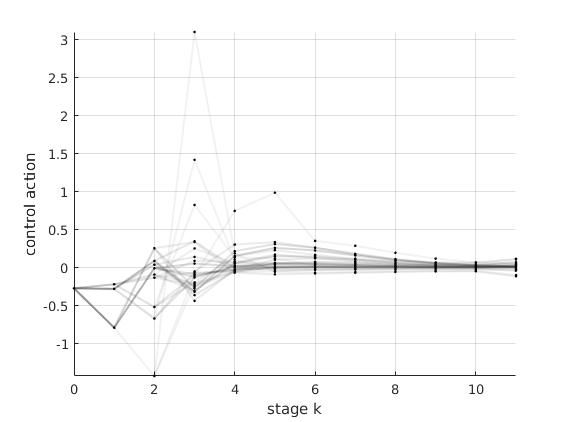
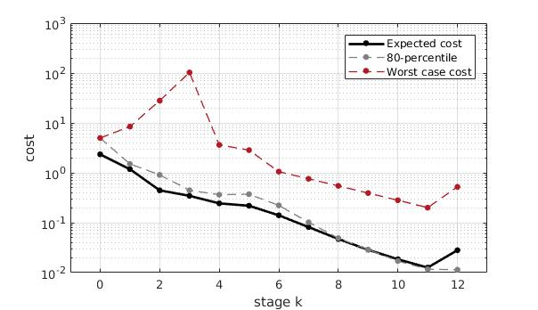
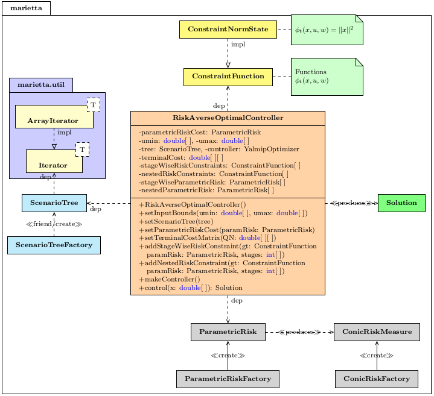

# Marietta

MATLAB toolbox for risk-averse optimization

This is still work in progress.

NOTE: Add `matlab/` to your path to be able to use this toolbox.

## Scenario trees

Scenario trees are finite-horizon representations of random processes on probability spaces with finitely many events.

Scenario trees are described by the class `marietta.ScenarioTree`.

Methods in this class allow us to access the nodes of a tree, traverse them, get their ancestor or children and much more. 

For more information type:

```matlab
doc marietta.ScenarioTree
```

Let us now see how to construct a scenario tree

### IID Process 
We may generate a scenario tree from a (stopped) IID process
 
```matlab
probDist = [0.6 0.4];      % probability distribution
ops.horizonLength = 15;    % horizon length
ops.branchingHorizon = 5;  % stopping time
tree = marietta.ScenarioTreeFactory.generateTreeFromIid(probDist, ops);
disp(tree);
plot(tree);
```

This will print

```
-----------------------------------
Scenario tree
-----------------------------------
+ Horizon....................    15
+ Number of nodes............   383
+ Number of scenarios........    32
+ Value dimension............     1
-----------------------------------
```

and will plot



### Markov Process 
or from a Markov chain with a given initial distribution and given probability transition matrix

```matlab
initialDistr = [0.2; 0.1; 0.0; 0.7];
probTransitionMatrix = [
    0.7  0.2  0.0  0.1;
    0.25 0.6  0.05 0.1;
    0.4  0.1  0.5  0.0;
    0.0  0.0  0.3  0.7];
ops.horizonLength = 4;
tree = marietta.ScenarioTreeFactory.generateTreeFromMarkovChain(...
    probTransitionMatrix, initialDistr, ops);
disp(tree);
```

This will print

```
-----------------------------------
Scenario tree
-----------------------------------
+ Horizon....................     4
+ Number of nodes............   116
+ Number of scenarios........    77
+ Value dimension............     1
-----------------------------------
```

### From Data

A tree can be constructed from available data

```matlab
options.ni = [2*ones(1,6) ones(1,10)];
tree = marietta.ScenarioTreeFactory.generateTreeFromData(data, options);
```


### Iterators: traversing the nodes

Iterators allow us to traverse certain nodes of the tree easily and efficiently, 
without having to write lots of for loops. 

This is how we can traverse all nodes of a tree at stage `k=3`

```matlab
iter = tree.getIteratorNodesAtStage(3)
while iter.hasNext
  nodeId = iter.next;
end
```

Likewise, to iterate over all non-leaf nodes, we may use the iterator
`iter = tree.getIteratorNonleafNodes`.

An iterator can be restarted using `iter.restart()`. 

For details checkout `help marietta.util.Iterator`.


## Construct risk measures

We may use `marietta.ConicRiskFactory` to construct risk measures.

For example, to create a `ConicRiskMeasure` object which corresponds to the average value-at-risk over a probability space with a given probability vector `p` at level `alpha`, use:

```matlab
avar = marietta.ConicRiskFactory.createAvar(p, alpha);
```

We may then use this object to compute the risk of a random variable `Z` using `avar.risk(Z)`.

Here is a complete example in which we compute the average value-at-risk and entropic value-at-risk of a random variable `Z` at different levels `alpha`

```matlab
n = 10; Z = exp(linspace(0,5,n))';
p = exp(-0.5*(1:n))'; xd = [];
for alpha = [0.001:0.01:0.1 0.2:0.1:0.9 0.94:0.02:1.0]
    avar = marietta.ConicRiskFactory.createAvar(p, alpha);
    evar = marietta.ConicRiskFactory.createEvar(p, alpha);
    avarZ = avar.risk(Z); evarZ = evar.risk(Z);
    xd = [xd; alpha avarZ evarZ];
end

figure;
plot(xd(:,1), xd(:,2),'-o','linewidth', 2); hold on;
plot(xd(:,1), xd(:,3),'-x','linewidth', 2);
legend('AVaR', 'EVaR'); grid on;
xlabel('alpha'); ylabel('risk')
```

This will plot:




## Parametric risk measures

Risk measures are defined relative to a probability space

Often they are parametrized with additional parameters `alpha` (e.g., the average value-at-risk and the entropic value-at-risk have such a scalar parameter).

A parametric risk measure is one which depends on the underlying distribution `p` and a parameter `alpha`

In `marietta`, parametric risks are functions which follow the template `@(p, alpha) parametricRisk`

The factory class `ParametricRiskFactory` can be used to generate such parametric risks

Here is an example of use

```matlab
p_avar = marietta.ParametricRiskFactory.createParametricAvar();

p = [0.1 0.2 0.7];             % probability vector
Z = [100 10 1];                % random variable
alpha = 0.5;                   % parameter of AVaR
risk_obj = p_avar(p, alpha);   % make risk object
risk_value = risk_obj.risk(Z); % use risk object

p_avar_05 = marietta.ParametricRiskFactory.createParametricAvarAlpha(0.5);
risk_obj_05 = p_avar_05(p);
risk_value_05 = risk_obj_05.risk(Z);
```

## Costs, constraints and dynamics

Costs, constraints and dynamics are functions of the system state, `x`, input `u` and uncertain parameter `w`, at stage `t`.

Terminal costs and constraints are functions of the terminal stage, `x_N` alone.

These are supported by:

- `marietta.functions.StageFunction` and
- `marietta.functions.TerminalFunction`

respectively.

For example, say we way to define a Markov jump affine system with 2 states, 1 input and 3 modes described by `x(t+1) = A(w(t)) x(t) + B(w(t)) u(t) + p(w(t))`, where `w(t)` takes the values `1`, `2` and `3`.

Here is an example of such a construction 

```matlab
A{1} = [1 2; 3 4];
A{2} = [3 1; 5 0];
A{3} = [1 1; 0 1];

B{1} = [1; 1];
B{2} = [0; 1];
B{3} = [1; 0];

p{1} = [3; 2];
p{2} = [3; 1];
p{3} = [1; 2];

mjas = marietta.functions.MarkovianLinearStateInputFunction(A, B, p);
```

Say now we want to construct a stage cost function of the form `ell(x,u,w) = x'*Q(w)*x + u'*R(w)*u`; here is an example

```matlab
Q{1} = eye(2); Q{2} = 10*eye(2);
R{1} = 1; R{2} = 1.3;
quad_cost = marietta.functions.MarkovianQuadStateInputFunction(Q, R);
```

## Risk-averse optimal control problems

This is a step-by-step guide to constructing and solving a risk-averse  optimal control problem.

### Problem definition
Let us first define some **parameters**:

```matlab
alpha = 0.8;                    % alpha
cAlpha = 0;                     % alpha used for risk constraints 
lambda_poisson = 2;             % Poisson parameter
num_modes = 3;                  % number of modes of Markov chain
horizon_length = 12;            % prediction horizon
branching_horizon = 3;          % branching horizon
umin = -10; umax = 10;          % input bounds
```

Then, we construct the **scenario tree**:

```matlab
pmf_poisson = truncated_poisson_pmf(lambda_poisson, num_modes);

% Define the scenario tree
initialDistr = pmf_poisson;

% Make sparse transition matrix
probTransitionMatrix = rand(num_modes, num_modes);
rowSumPTM = sum(probTransitionMatrix, 2)';
probTransitionMatrix = probTransitionMatrix ./ kron(ones(1, num_modes), rowSumPTM');


% Make the scenario tree
tree_options.horizonLength = horizon_length;
tree_options.branchingHorizon = branching_horizon;
tree = marietta.ScenarioTreeFactory.generateTreeFromMarkovChain(...
    probTransitionMatrix, initialDistr, tree_options);
```
The system is an MJLS and the stage cost is quadratic given by `ell(x,u,w) = x'*Q(w)*x + u'*R(w)*u`.

Let us define such matrices...

```matlab
% Define the data (system parameters and more)
A = cell(num_modes, 1);
B = cell(num_modes, 1);
Q = cell(num_modes, 1);
R = cell(num_modes, 1);
for i=1:num_modes
    re_ = 0.95 + 0.1 * randn;
    im_ = 0.3 + i * 0.05 * randn;
    u = orth(randn(2));
    A{i} = u*[re_ im_; -im_ re_]*u';
    B{i} = u*[1; 0.1*randn];
    Q{i} = (1+0.05*randn)*eye(2);
    R{i} = 1 + 0.01*randn;
end
Q{num_modes} = 10*Q{num_modes};
```
We now define the **stage cost function** and the **system dynamics**:

```matlab
dynamics = marietta.functions.MarkovianLinearStateInputFunction(A, B);
stageCost = marietta.functions.MarkovianQuadStateInputFunction(Q, R);
```

Similarly, we define the **terminal cost function** `ell_N(x) = x'*QN*x`:

```matlab
QN = 70*eye(2);
terminalCost = marietta.functions.QuadTerminalFunction(QN);
```
We need to impose that `r_t[phi(x_t,u_t,w_t)] <= 0`, where `r_t` is a risk measure at stage `t`.

Here is an example of such a function `phi(x,u,w) = x'*x - c`:

```matlab
c = 0.5;
stateNorm = marietta.functions.SimpleQuadStateInputFunction(eye(2), 0); 
stageConstraint = stateNorm - c; % using operator overloading
```


### Risk-averse optimizers
Let us now construct a risk averse optimizer (using the Builder pattern)...

```matlab
pAvar = marietta.ParametricRiskFactory.createParametricAvarAlpha(alpha);
pAvarConstr = marietta.ParametricRiskFactory.createParametricAvarAlpha(cAlpha);
rao = marietta.RiskAverseOptimalController();

rao.setInputBounds(umin,umax)...
    .setScenarioTree(tree)...
    .setDynamics(dynamics)...
    .setStageCost(stageCost)...
    .setParametricRiskCost(pAvar)...
    .setTerminalCost(terminalCost)...
    .addStageWiseRiskConstraints(stageConstraint, pAvarConstr, horizon_length-6:horizon_length-1);

rao.makeController();
```

We can now use the above controller/optimizer to solve a problem given an  initial state `x0`...

```matlab
x0 = [-3;3.5];
solution = rao.control(x0);
```

The solution is a `marietta.Solution` object:

```
-------------------------------------
Risk-averse Optimal Controller
-------------------------------------
Numer of decision variables :    1943
Number of constraints       :    4341
Elapsed time is 0.175558 seconds.
Solution ( Successfully solved )
State dimension    :     2
Input dimension    :     1
Prediction horizon :    12
Number of nodes    :   283
Status code        :     0
```

### Visualization
We may now plot the solution using

```matlab
figure;
subplot(121); solution.plotStateCoordinate(1);
subplot(122); solution.plotStateCoordinate(2);
```

this produces...



Similarly, we may plot the control actions on the tree:

```matlab
figure;
solution.plotInputCoordinate(1);
```



We may also plot an error bar that gives information about the distribution of the stage costs 

```matlab
figure;
solution.plotCostErrorBar(1-alpha, tree.getHorizon)
```


## Documentation

In MATLAB, type

```matlab
doc marietta
```

to access the documentation of this toolbox.

## UML of marietta



(*) the UML needs to be updated.